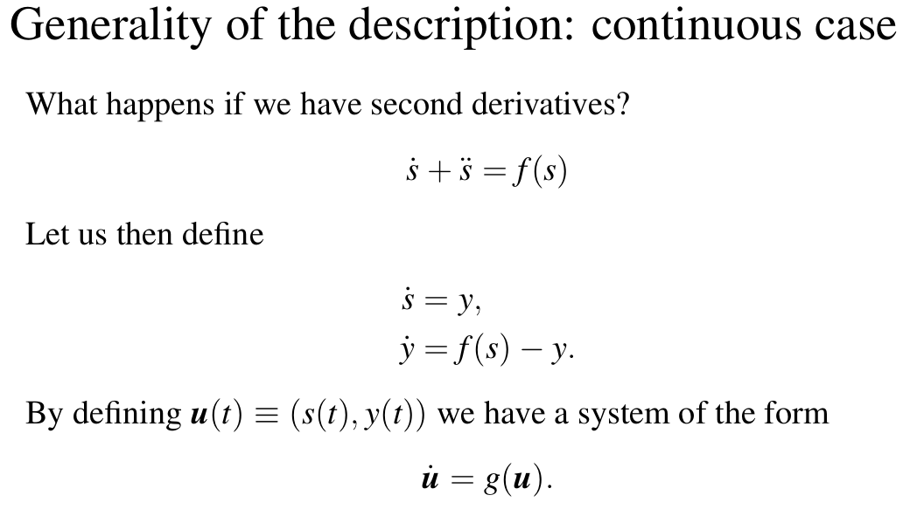

# Simulation and modeling of natural processes : Exam questions  

<https://moodle.unige.ch/course/view.php?id=14916>  

<https://www.coursera.org/learn/modeling-simulation-natural-processes>  

## Questions preparation  

[x] Question 1  
[~] Question 2  
[ ] Question 3  
[ ] Question 4  
[ ] Question 5  
[ ] Question 6  
[ ] Question 7  
[ ] Question 8  
[ ] Question 9  
[ ] Question 10  
[ ] Question 11  
[x] Question 12  
[~] Question 13  
[ ] Question 14  
[ ] Question 15  
[ ] Question 16  
[ ] Question 17  
[ ] Question 18  
[ ] Question 19  
[ ] Question 20  
[ ] Question 21  
[ ] Question 22  
[ ] Question 23  

## Question 1  

_**How can one describe a natural system in view of a modeling and simulation approach?**_  
_**How are time and space handled?**_  
_**Why does one need various modeling approaches?**_  
_**What do "boundary conditions" and "initial condition" mean?**_  
  
**Natural System**  
Different scales : molecule, cells, tissues, car, traffic, ...  
"You should really adapt your model level to the question and the scale at which you want to answer your problem."  
  
**Space and Time**  
"All the system, they evolve in time and the state of the system may change in place." But sometimes we consider only one of these aspects (e.g. number of individuals -> no space, temperature in a room depending of location -> no time)  

- Time : It is a continuous value and only mathematical models (Diff equations) can deal with it, otherwise we discretize it (time-steps). We might also want to focus only on events. In that case time is not discretized, because you can potentially have any value for the time for the event you're interested in. But you are not looking in a continuous way at your system.  
- Space : Like for time it can be continuous or discretized. There is different ways to do it.  

  - Eulerian approach : the observer sits at a fixed position in space. We attach a physical property or state to each point of the space. (e.g. grid)  
  - Lagrangian approach : the observer takes the point of view of the moving objects. We give the position of all objects of interest as a function over time. (e.g. particles anywhere in the domain)  
  
  **(+)** Complex systems (use of graphs (not physical space))

**Why various modelling approach ?**  
We need various approach to better adapt to the problem ve want to solve as well as the scale needed (often finer than the scale of the question). We may need different models to study the different aspects of a same phenomenon.

**Initial and boundary conditions**  
An initial condition is a value of an evolving variable at some point in time designated as the initial time (typically denoted $t=0$). The boundary conditions are spatial constraint that describe the comportment of the system at the extremities.  
Examples : diffusion equation, lattice gas  

## Question 2  

_**What is a dynamical system and how are they described?**_  
_**Explain the concepts of fixed point, limit cycle and chaos.**_  
_**Give examples.**_  

**Dynamical system**  
It is a system that varies through time, with states $s$.  

- Discrete dynamical systems : They have finite time steps and are defined by recurrence relations. $s(t+\Delta t)=f(s(t))$  
    
- Continuous dynamical systems : They are described by differential equations. $\dot{s} \equiv \frac{ds}{dt}=f(s(t))$  
     

**Fixed point**  
When the evolution of a dynamical system stabilize itself it can be a fixed point.**TO COMPLETE**

**Limit cycle**  
after a certain time, the system oscillates between several possible states, always the same ones. **TO COMPLETE** 

**Chaos**  
t

**TO COMPLETE !!!**(change alt txt) week 3

## Question 3  

_**How can one solve differential equations, both ordinary and partial ones?**_  

**Ordinary differential equations**  
t

**Partial differential equations**  
t

**TO COMPLETE** week 3  

## Question 4  

_**Explain the concept of "balance equations" in the context of dynamical systems.**_  
_**Explain the method of "vannes et réservoirs".**_  
_**Illustrate the approach on a problem of your choice.**_  

**TO COMPLETE** week 3  

## Question 5  

_**Defined a cellular automaton (CA), both intuitively and mathematically.**_  
_**Explain the goal of this approach.**_  
_**Explain how the evolution can be computed and discuss how many CA exist.**_

**TO COMPLETE** week 4  

## Question 6  

_**Explain the cellular automata rule for car traffic. How can you justify it?**_  
_**Can you propose interesting boundary conditions or additional features?**_  

**TO COMPLETE** week 4  

## Question 7  

_**Propose a cellular automata to model a Lotka-Voltera process.**_  
_**Discuss your choice and hypothesis and compare your approach to other ways of describing a prey-predator system.**_  

**TO COMPLETE** week 3 + ???  

## Question 8  

_**What is a lattice-gas?**_  
_**Explain the HPP model and its central physical properties.**_  

**TO COMPLETE** week 4  

## Question 9  

_**What is a diffusion process?**_  
_**Explain the different approaches discussed in the course.**_  

??????  week 3 ?

## Question 10  

_**Explain the concept of a Monte-Carlo simulation to simulate a natural process.**_  
_**Give simple examples.**_  

**TO COMPLETE** week 1  

## Question 11  

_**Explain how Monte-Carlo simulations are used to sample a given probability distribution.**_  
_**Give an example that illustrates the link with the modeling approach.**_  

**TO COMPLETE !!!** week 1

## Question 12  

_**What are the main quantities used to specify a graph?**_  
_**Additionally, define the clustering coefficient and explain its meaning.**_  
_**What does "centrality" mean?**_  

**Graph main quantities**  
A graph is defined by its _nodes_ and _edges_. The number of nodes $n$ is the _order_ of the graph and the number of edges $m$ is the _size_ of the graph.  
The graph can be directed, undirected and weighted.  
It can contain sub-graphs, cliques (a subset of edges of an undirected graph such that every two distinct edge in the clique are adjacent), ... 
We can compute the _adjacency matrix_ $A_{ij}$ : $A_{ij}=1$ if there is a link from $j$ to $i$  
The degree of a node $k_{i}$ is the number of links from it. In directed graphs we define $k_{i}^{in}=\sum_{j}A_{ij}$ and $k_{i}^{out}=\sum_{j}A_{ji}$  
The distance $d_{ij} between two nodes is the length of the shortest path. The diameter $D$ is the maximum distance over all pairs of nodes.

When used to represent a dynamical systems nodes from a graph can have a value that depends on time. They can also change their value according to the value of their neighbors.
$s_{i}(t + \Delta t) = f(\{s_{j}(t)\})$
where $\{s_{j}(t)\})$ is the values of nodes $j$ connected to $i$  

**Clustering coefficient**  
It measures the number of neighbors that are themselves connected. The clustering coefficient $C_{i}$ for node $i$ is defined as $C_{i}=\frac{number~of~pairs~of~neighbors~of~i~that~are~connected}{number~of~pairs~of~neighbors}$

**Centrality**  
Centrality is a measure of the importance of a node with
respect to the others in the graph. There are various centrality metrics :  
- Degree centrality : is simply the degree of the node.
- Eigenvector centrality : the idea of this centrality is that the importance (or score) $x_{i}$ of a node $i$ is determined by the importance of the nodes pointing to it. The score of a node is proportional to the sum of the scores of its incoming neighbors.  
- Closeness centrality : It is defined as the closeness of node i with respect to all the others $C_{i} = \frac{1}{\frac{1}{n}\sum_{j}d_{ij}}=\frac{n}{\sum_{j}d_{ij}}$  
- Betweenness centrality : The betweenness centrality measures the importance of the edges of the graphs. Let $\mathcal{l}$ be an edge and let $n_{ij}^{\mathcal{l}}$ the number of shortest paths between nodes $i$ et $j$ which use edge $\mathcal{l}$. Let $g_{ij}$ be the number of shortest paths between $i$ and $j$.The betweenness centrality is $c_{\mathcal{l}} =\sum_{ij}\frac{n_{ij}^{\mathcal{l}}}{g_{ij}}$
- ... (page rank, katz centrality)

## Question 13  

_**Explain what "assortativity" means in a complex network, and how it can be measured.**_  
_**What is a "community" and how can one determine them?**_  

**Assortativity**  
The concept of assortative mixing describes the tendency of a node to link with the nodes that share the same property. In a social network, links preferably connect similar persons. More rarely, one observes a diassortative mixing, the association of persons with difference : for instance, a marriage is a link between persons of different gender. A network is said to be assortative if a significant fraction of its edges connects nodes sharing a common feature.  

To measure the assortativity of a graph we define the modularity. Let $c_i$ be the attribute of node $i$ in the graph. Let us assume that there are $\mathcal{l} possible attributes : $c_i \in \{1, 2,...,\mathcal{l}\}$.  
$N_m$ is defined as the number of links that connect similar nodes in the sense of the value $c_i$. $N_{m}=\displaystyle\sum_{edges(i,j)}\delta (c_{i},c_{j}) = \frac{1}{2}\sum_{ij}A_{ij}\delta (c_{i},c_{j})$ where $\delta (c_{i},c_{j})$ the Kronecker function $\delta (x, y) = 1$ if $x=y$, and $0$ otherwise.  
We need to compar it to a reference value. There for we compute $N_{a}$ the expected number of links between similar nodes in a random graph. $N_{a}
= \frac{1}{2}\sum_{ij}\frac{k_i k_j}{2m}\delta (c_{i},c_{j})$ where $k_i$ is the degree of node $i$, $2m$ the number of edge extremities to be connected and $\frac{k_i k_j}{2m}$ is the expected number of links between $i$ and $j$.  
if $Q =\frac{N_{m}-N_{a}}{m}$ the modularity is greater than 0 there is assortativity, otherwise deassortativity

**Community**  
We call communities a group of nodes that have more
in common together than with nodes in another community. A community is a sub-graph.
**TO COMPLETE**

## Question 14  

_**How can you build a graph on a computer?**_  
_**What are the different types of graphs?**_  
_**Propose a dynamical model of your choice on a complex network and discuss it.**_  

?????  

## Question 15  

_**What is the lattice Boltzmann method?**_  
_**Explain the purpose of the method, define the method through its equations, and provide a brief explanation on how to write an algorithm for this method.**_

**TO COMPLETE** week 5  

## Question 16  

_**Explain the term "Computational Fluid Dynamics".**_  
_**Explain how a lattice-gas and the lattice Boltzmann method are used in this context, and explain the differences between the two approaches.**_  

**TO COMPLETE** week 5  

## Question 17  

_**Explain the purpose of the Barnes-Hut algorithm and provide details about how the algorithm works.**_  

**TO COMPLETE** week 6  

## Question 18  

_**Present three inter-particle potentials (gravity, Coulomb, Lennard-Jones).**_  
_**Explain the algorithmic complexity of resolving the interaction between particles, and explain the possible work-arounds for each of the three potentials.**_  

**TO COMPLETE** week 6  

## Question 19  

_**Present three inter-particle potentials (gravity, Coulomb, Lennard-Jones), explain the concept of short-range and long-range interaction and their impact on algorithmic complexity.**_  
_**Present the equations of motion for many-particle systems, and the Verlet ("leap-frog") algorithm for their temporal integration.**_  

**TO COMPLETE** week 6  

## Question 20  

_**What are agent based models ?**_  
_**Define the different kind of agents.**_  
_**Define the behavior and discuss implementations.**_  
_**Illustrate with examples.**_  

**TO COMPLETE** week 8  

## Question 21  

_**Discuss about agents models spatial aspects, various topologies and neighborhoods.**_  
_**Detail the different approaches and their consequences.**_  
_**Illustrate with examples.**_

**TO COMPLETE** week 8  

## Question 22  

_**What are discrete events models ?**_  
_**Define the different elements of such models, and the differences with continuous time approach. Illustrate with examples.**_  

**TO COMPLETE** week 7  

## Question 23  

_**Discuss about discrete event systems implementation.**_  
_**After summarizing the discrete events approach, propose concrete methods to implements them efficiently.**_

**TO COMPLETE** week 7  
